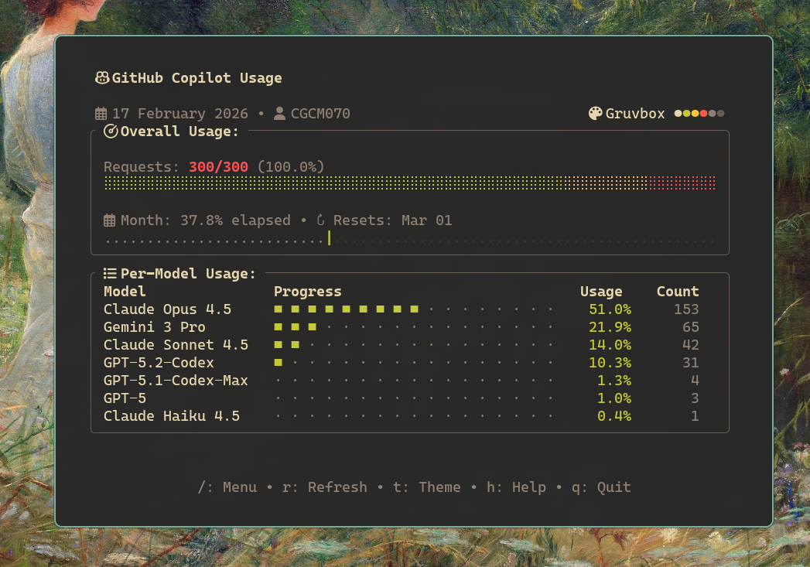
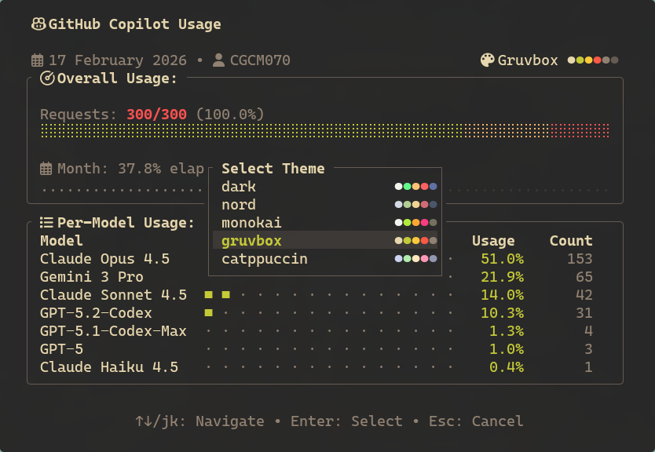
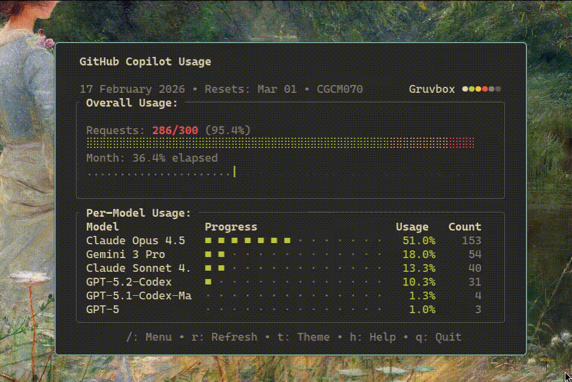

# Copilot Usage

[](https://www.rust-lang.org/)
[](LICENSE)
[](https://kernel.org/)

GitHub Copilot usage tracker CLI - Terminal-based tool written in Rust to visualize GitHub Copilot Pro usage with an interactive dashboard, multiple themes, and Waybar integration for Hyprland.

**Tested on Linux** - specifically designed and tested on Linux systems with Hyprland window manager.



## Features

- **Interactive Dashboard** with segmented progress bars (green → orange → red)
- **9 Visual Themes**: dark, nord, monokai, gruvbox, catppuccin, onedark, tokyonight, solarized, kanagawa
- **Async Architecture** with smooth animations (20 FPS)54
- **Smart Caching** with configurable TTL (default: 5 minutes)
- **Interactive Modals**: theme selector, command menu, help, cache info
- **Waybar Integration** for Hyprland status bar (tested on Hyprland)
- **Interactive Setup** for first-time configuration

## Available Themes



## Installation

### Option 1: Installation Script (Recommended)

```bash
git clone https://github.com/tu-usuario/copilot-usage.git
cd copilot-usage
./install.sh
```

### Option 2: Quick Install (Development)

```bash
./quick-install.sh
```

### Option 3: Manual with Cargo

```bash
# Compile and install
cargo install --path . --force

# Or traditional
cargo build --release
cp target/release/copilot-usage ~/.local/bin/
```

## Initial Setup

The first time you run the program, an interactive setup will start:

```bash
copilot-usage
```

### Create Personal Access Token

1. Go to: https://github.com/settings/personal-access-tokens/new
2. **Token name**: Any name (e.g., "Copilot Usage CLI")
3. **Resource owner**: Select your account
4. **Expiration**: Choose your preferred duration
5. **Repository access**: "Public repositories" is sufficient
6. **Account permissions** (IMPORTANT):
   - Look for **"Plan"** (NOT "Copilot Requests")
   - Select **"Read-only"**
7. Generate and copy the token

**Note**: The required permission is **"Plan"**, not "Copilot Requests". These are different permissions.

### Select Theme

After entering the token, choose your preferred theme from the 9 available options. Configuration is saved to: `~/.config/copilot-usage/config.toml`

## Usage

### View Interactive Dashboard
```bash
copilot-usage
```

### Force Refresh from API
```bash
copilot-usage --refresh
```



### Check Cache Status
```bash
copilot-usage --cache-status
```

### Change Theme Temporarily
```bash
copilot-usage --theme nord
```

### Waybar Mode (JSON Output)
```bash
copilot-usage --waybar
```

### Reconfigure Token
```bash
copilot-usage reconfigure
```

### View Current Configuration
```bash
copilot-usage config
```

### Reset Configuration
```bash
copilot-usage reset
```

## Keyboard Shortcuts in Dashboard

| Key | Action |
|-------|--------|
| `r` | Refresh data from API |
| `t` | Open theme selector |
| `/` | Open command menu |
| `c` | Show cache information |
| `?` | Show help |
| `Esc` or `q` | Close modal / Exit |

## Waybar Integration for Hyprland

This integration has been specifically tested on **Hyprland** window manager. To display Copilot usage in your Waybar:

### 1. Add to Waybar config (`~/.config/waybar/config`):

```json
"custom/copilot": {
  "exec": "copilot-usage --waybar",
  "interval": 300,
  "return-type": "json",
  "format": "{}",
  "tooltip": true,
  "class": "copilot-usage"
}
```

### 2. Add CSS styles (`~/.config/waybar/style.css`):

```css
#custom-copilot {
  padding: 0 10px;
  margin: 0 5px;
}

#custom-copilot.copilot-critical {
  color: #f38ba8;
}

#custom-copilot.copilot-warning {
  color: #fab387;
}

#custom-copilot.copilot-normal {
  color: #f9e2af;
}

#custom-copilot.copilot-low {
  color: #a6e3a1;
}
```

### 3. Result:


**Note**: While Waybar is supported on various Wayland compositors, this integration has been primarily tested on Hyprland.

## Architecture

```
Terminal UI (ratatui)
├─ UI Components (Header, Progress Bar, Model Table)
├─ Event Loop (50ms poll, 20 FPS)
└─ Async Handler (tokio)
    ├─ Background API calls
    ├─ Cache operations
    └─ mpsc channels
        ↓
GitHub API
└─ /users/{username}/settings/billing/premium_request/usage
```

### Technical Features:

- **Async Architecture**: tokio + mpsc channels + non-blocking event loop
- **State Machine**: AppState enum with explicit transitions
- **Pure Components**: Rendering functions with no side effects
- **Consistent Colors**: Warning (orange) and Error (red) constant across all themes

## File Structure

```
~/.config/copilot-usage/
└── config.toml          # Configuration (token, theme, TTL)

~/.cache/copilot-usage/
└── usage.json           # Usage data cache
```

## Manual Configuration

Example of `~/.config/copilot-usage/config.toml`:

```toml
token = "github_pat_xxxxxxxx"
theme = "nord"
cache_ttl_minutes = 5
waybar_format = "{percentage}%"
username = "your-username"
```

### Available Options:

- **token**: GitHub Personal Access Token with `Plan (Read)` permission
- **theme**: One of: dark, nord, monokai, gruvbox, catppuccin, onedark, tokyonight, solarized, kanagawa
- **cache_ttl_minutes**: Cache TTL in minutes (default: 5)
- **waybar_format**: Format for Waybar (uses `{percentage}`, `{used}`, `{limit}`, `{remaining}`)
- **username**: Your GitHub username (auto-detected)

## Development

### Useful Commands

```bash
# Format code
cargo fmt

# Run linter
cargo clippy -- -D warnings

# Run tests
cargo test

# Build release
cargo build --release
```

### Pre-commit Checks

```bash
cargo build --release && cargo clippy -- -D warnings && cargo fmt -- --check
```

## Requirements

- **Rust** 1.70+ (to compile)
- **GitHub Personal Access Token** with `Plan (Read)` permission
- **Linux** (tested on Linux systems with Hyprland)
- Terminal with Unicode support (for progress bar characters)

## Troubleshooting

### Error: "Token validation failed"
- Verify the token has `Plan (Read)` permission
- Fine-grained tokens need account permission, not repository permission
- Try a classic token with `read:user` scope

### Spinner Not Visible
- Your terminal needs Braille Unicode character support
- Test with Alacritty, Kitty, or GNOME Terminal
- Verify: `echo "⠋⠙⠹⠸⠼⠴⠦⠧⠇⠏"`

### Cache Always Expired
- Verify the file exists: `ls ~/.cache/copilot-usage/`
- Check permissions: `ls -la ~/.cache/copilot-usage/`
- Default TTL is 5 minutes

## Platform Notes

This tool has been **developed and tested exclusively on Linux** systems. While it may work on other platforms, it is specifically designed for:

- Linux terminals with Unicode support
- Hyprland window manager for Waybar integration
- XDG-compliant directory structure (`~/.config/`, `~/.cache/`)


---

Built with Rust for Linux systems
